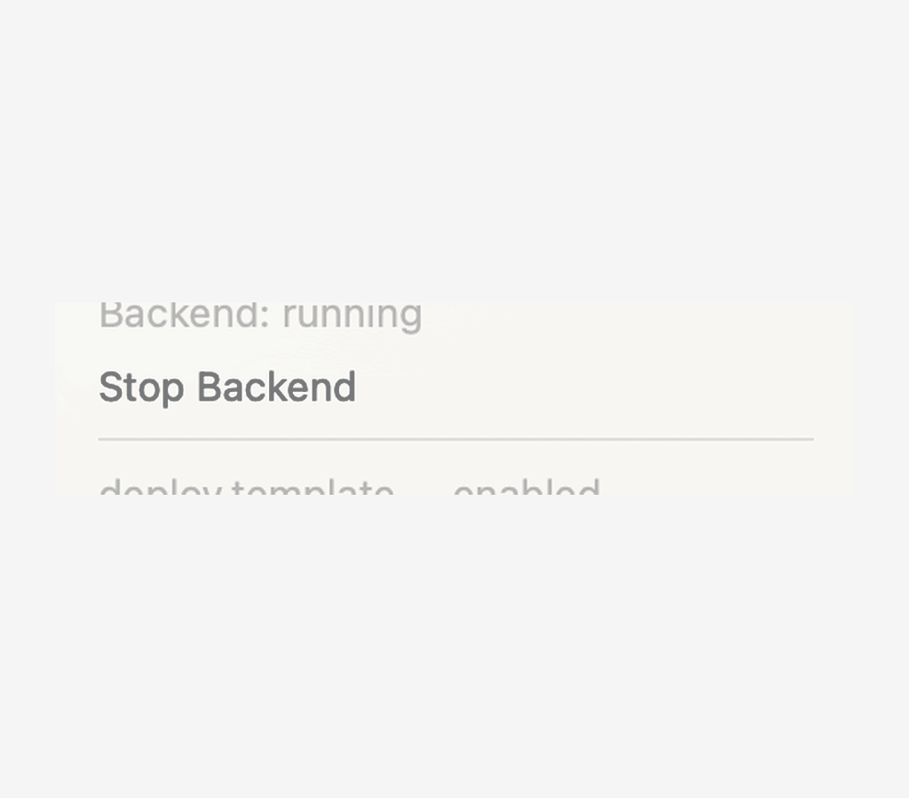
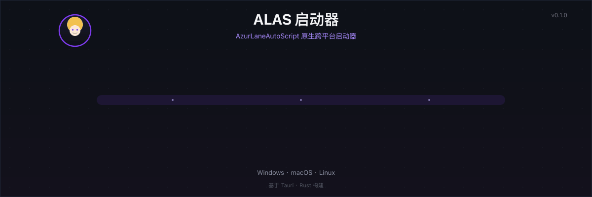
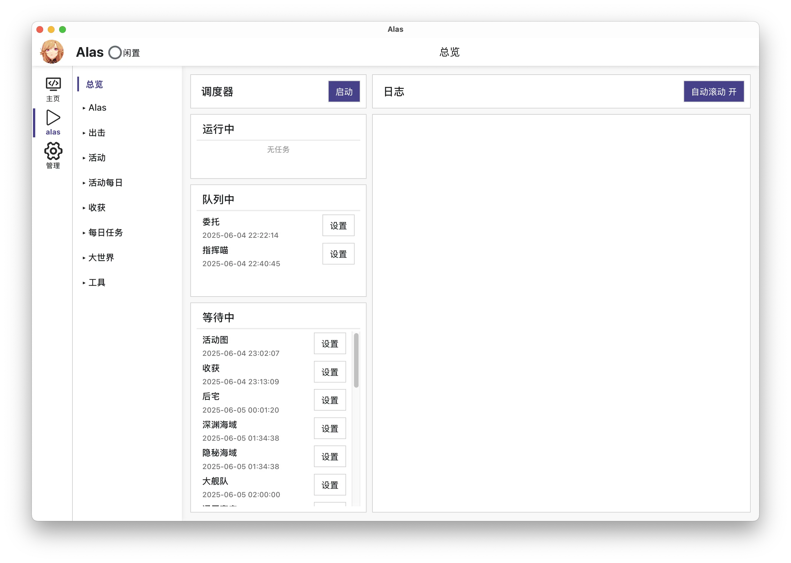
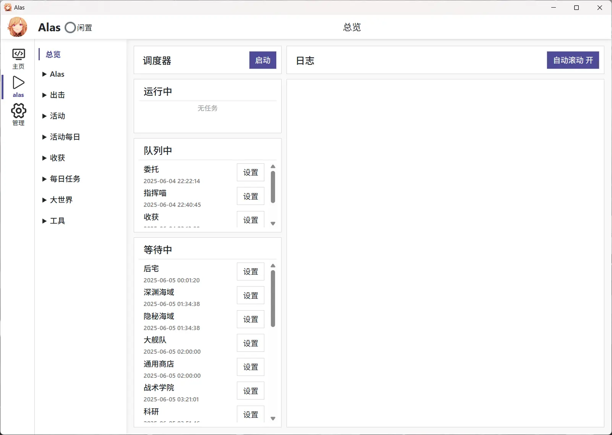
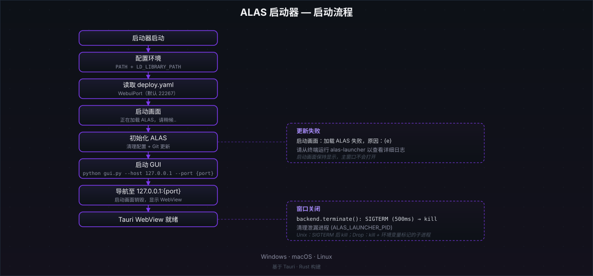

**| [English](README_en.md) | 简体中文 |**

# ALAS Launcher：AzurLaneAutoScript 的跨平台原生启动器

ALAS Launcher 是一个基于 Tauri 2（Rust）的桌面启动器，用于在 Windows、macOS 和 Linux 上原生启动 [AzurLaneAutoScript](https://github.com/LmeSzinc/AzurLaneAutoScript)（ALAS），不经过转译层，也不依赖 Docker。

启动时它会准备运行环境（Python toolkit、Git、Adb），更新 ALAS 仓库，在本机端口启动 `gui.py`，然后由 Tauri WebView 打开本地 Web UI。默认端口为 `22267`，可在 `config/deploy.yaml` 的 `Deploy.Webui.WebuiPort` 修改。

macOS 上还带一个菜单栏图标：不用打开窗口就能查看 ALAS 任务列表、启停调度器。先看下方的[菜单栏速览动图](#菜单栏速览macos)，再对照[启动流程动图](#启动流程)与[真实界面截图](#界面截图)，然后选择你的[下载平台](#下载与平台)。

## 菜单栏速览（macOS）



- **任务列表实时可见**：与 Web UI 调度器一致，按 `运行中 / 队列中 / 等待中` 分组展示真实 ALAS 任务与下次调度时间（每组最多 3 条，保持菜单紧凑；10 秒自动刷新，也可手动刷新）。
- **调度器一键启停**：菜单开关启停的是 ALAS 调度器而非后端进程——停止调度器后 Web UI 保持存活；后端未运行时点击开关会先启动后端，再启动调度器。
- **仅 macOS**：菜单栏图标目前只在 macOS 上启用，Windows / Linux 构建不受影响。

动图无法播放时，可查看[静态截图版](screenshots/mac-cn.webp)或[启动流程静态示意图](assets/readme/hero-zh.svg)。

## 启动流程



启动器按以下顺序工作：

1. **初始化**：准备运行环境（PATH、LD_LIBRARY_PATH 等）。
2. **更新**：清理 ALAS 配置目录，拉取 ALAS 仓库更新。
3. **启动**：在本机端口（默认 `22267`）启动 `gui.py`。
4. **就绪**：Tauri WebView 导航到本地 Web UI，显示 `Ready · 127.0.0.1:22267`。

动图无法播放时，可查看[静态版示意图](assets/readme/hero-zh.svg)（内容相同）。

## 界面截图

以下是 macOS 和 Windows 上的真实界面（简体中文界面）：

| macOS | Windows |
| --- | --- |
|  |  |

## 下载与平台

到 [Releases 页面](https://github.com/Acfufu/alas-launcher/releases) 下载对应系统和 CPU 架构的压缩包，解压后按对应平台的方式启动。

> 当前远程 Release（`v0.1.0`）为手动构建的草稿版本，尚未声明为稳定公开安装包，使用前请自行验证。

- **Windows**：运行 `alas-launcher.exe`。如果使用 Windows 7、8 或 10，请先安装 [WebView2](https://developer.microsoft.com/zh-cn/microsoft-edge/webview2)。
- **macOS**：打开 `AzurLaneAutoScript.app`。应用未签名，若被 Gatekeeper 拦截，请打开终端执行：

  ```bash
  xattr -dr com.apple.quarantine AzurLaneAutoScript.app
  ```

- **Linux**：运行 `alas-launcher`。程序依赖 `libwebkit2gtk-4.1` 和较新的 `glibc`（CI 使用 Ubuntu 22.04）。缺少这些依赖时启动器可能无法运行，但 ALAS 本体通常不受影响。

Web UI 默认监听端口为 `22267`，启动器启动时会读取 `config/deploy.yaml`，端口可在其中的 `Deploy.Webui.WebuiPort` 修改。

## 与官方版的差异

与官方 ALAS 启动器相比，这个版本有以下用户可见差异：

1. **跨平台**：同一套代码原生支持 Windows、macOS 和 Linux。
2. **macOS 菜单栏速览**：菜单栏图标直接查看 ALAS 任务列表（运行中/队列中/等待中分组、下次调度时间），并可启停调度器而无需退出应用（停止调度器时 Web UI 保持存活）。
3. **启动时只更新仓库**：不再自动杀掉已有进程、更新 pip、更新 Electron 资源或重启 adb。
4. **单实例**：重复启动不会开第二个窗口，而是重新聚焦已有窗口。
5. **pip 自动更新已禁用**：Python 包版本与官方版略有差异，但不影响使用；若上游加入 requirements 文件，可再实现 pip 更新。
6. **adb 重启/替换未实现**。
7. **目录结构有调整**（见[目录结构与环境变量](#目录结构与环境变量)）。

## 工作流



启动链路为：**启动器 → 环境配置 → 读取 `config/deploy.yaml`（默认端口 `22267`）→ 清理配置 + 更新 ALAS Git 仓库 → 启动 `gui.py --host 127.0.0.1 --port <配置端口>` → Tauri WebView 导航到本地 Web UI**。

仓库更新失败时，启动画面会继续显示错误信息；退出时，后端进程会被终止。adb 替换、pip 自动更新和远程访问不属于启动器职责，图中不包含。

## 构建与完整 payload 组装

### 构建 macOS 启动器外壳

依赖：[Rust](https://rustup.rs)（stable）、Node.js（提供 npx）、Xcode Command Line Tools。

```bash
npx --yes @tauri-apps/cli@2 build --bundles app
```

产物在 `target/release/bundle/macos/AzurLaneAutoScript.app`。

### 拼装完整 payload

上面的产物只是启动器外壳，不含 ALAS 本体。完整可用的版本需要把 payload（Python toolkit / git / adb / ALAS 仓库）放进 `Contents/AzurLaneAutoScript`。可以从已有安装拷贝：

```bash
APP=target/release/bundle/macos/AzurLaneAutoScript.app
cp -R /Applications/AzurLaneAutoScript.app/Contents/AzurLaneAutoScript "$APP/Contents/"
```

完整产物统一放到 `release/` 目录（已 gitignore，避免误提交）：

```bash
cp -R target/release/bundle/macos/AzurLaneAutoScript.app release/
```


### 发布

发布是手动流程：本地构建完整 `.app`（含 payload），放进 `release/`，然后发版。命令见下方折叠块，版本号必须与 `tauri.conf.json` 的 `version` 一致：

<details>
<summary>发布命令</summary>

```bash
git tag v0.1.0            # 版本号与 tauri.conf.json 的 version 一致
git push origin v0.1.0
gh release create v0.1.0 release/AzurLaneAutoScript.app --title "v0.1.0" --notes "..."
```

</details>

## 目录结构与环境变量

以下路径以 ALAS 根目录为基准，`toolkit` 为 Python 环境目录（类似 venv 结构）：

| 组件 | Windows | macOS | Linux |
| --- | --- | --- | --- |
| ALAS 根目录 | `AzurLaneAutoScript` | `AzurLaneAutoScript.app/Contents/AzurLaneAutoScript` | `AzurLaneAutoScript` |
| 启动器 | `AzurLaneAutoScript/alas-launcher.exe` | `AzurLaneAutoScript.app/Contents/MacOS/alas-launcher` | `AzurLaneAutoScript/alas-launcher` |
| Python | `toolkit` | `toolkit` | `toolkit` |
| Git | MinGit 解压到 `toolkit/git` | Unix 目录结构装入 `toolkit` | Unix 目录结构装入 `toolkit` |
| Adb | `toolkit/adb.exe` | `toolkit/bin/adb` | `toolkit/bin/adb` |

启动器会加入以下环境变量：

- **Unix**：`toolkit/bin`、`toolkit/libexec/git-core`，以及 `toolkit/lib`（`LD_LIBRARY_PATH`）。
- **Windows**：`toolkit`、`toolkit/Scripts`、`toolkit/git/cmd`。

## 限制、故障排查与许可

### 限制

- 启动器外壳不含 ALAS payload，需要手动拼装（见[构建与完整 payload 组装](#构建与完整-payload-组装)）。
- macOS 应用未签名，首次打开需要手动解除 quarantine。
- 菜单栏速览（任务列表/调度器启停）仅在 macOS 上启用。
- Linux 依赖 `libwebkit2gtk-4.1` 与较新的 `glibc`。
- adb 重启/替换未实现；pip 自动更新已禁用。
- 远程 Release 为草稿，尚未声明为稳定公开安装包。

### 故障排查

| 现象 | 处理 |
| --- | --- |
| macOS 提示应用已损坏或无法打开 | 执行 `xattr -dr com.apple.quarantine AzurLaneAutoScript.app` |
| Linux 启动器无法启动，但 ALAS 本体可运行 | 安装 `libwebkit2gtk-4.1`，或升级系统 `glibc` |
| 端口被占用或想更换端口 | 修改 `config/deploy.yaml` 的 `Deploy.Webui.WebuiPort`（默认 `22267`） |
| 菜单栏任务列表为空或显示「Tasks: unavailable」 | 确认 ALAS 后端在运行（菜单可一键启动）；任务数据直接来自 `config/alas.json` |

### 许可

因为 ALAS 使用 GPLv3，本启动器也使用 GPLv3。多数依赖为 Apache-2.0、BSD-3-Clause 等宽松许可，具体请查阅各上游仓库。
