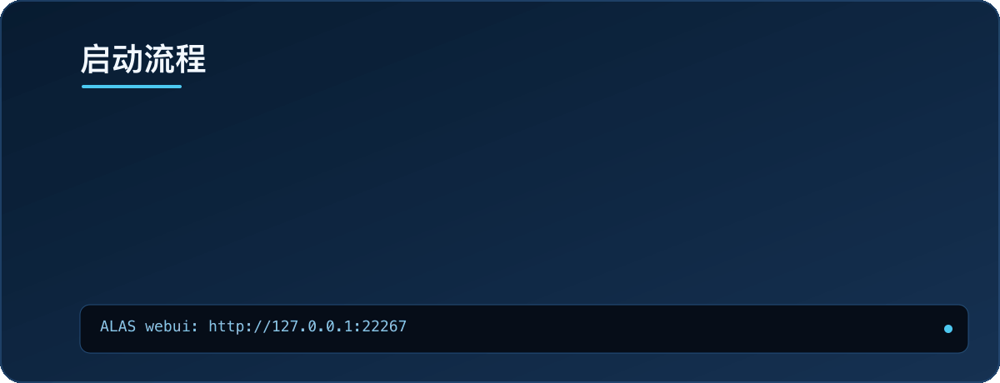
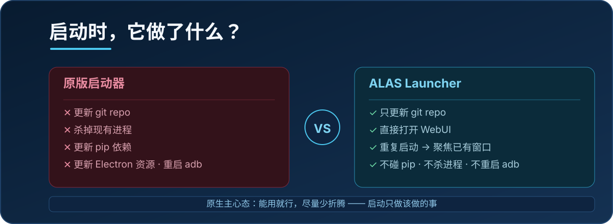
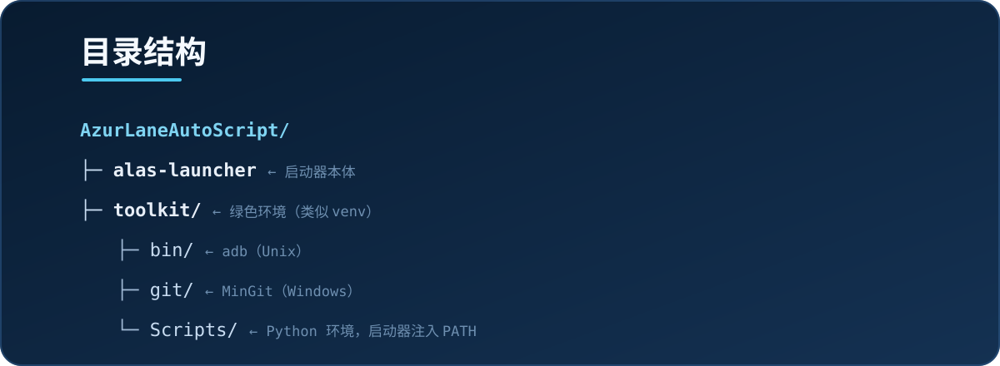
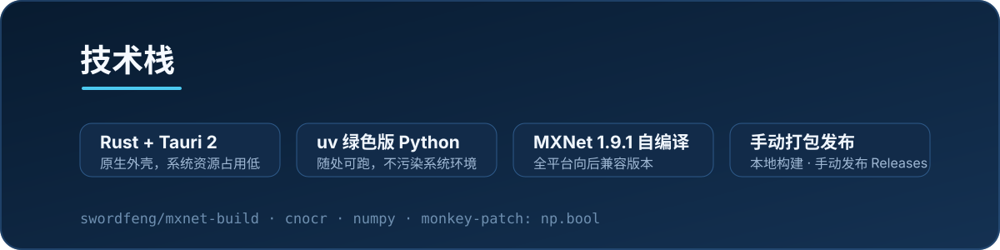

**| [English](README_en.md) | 简体中文 |**

# ALAS Launcher

一种新型的 [AzurLaneAutoScript](https://github.com/LmeSzinc/AzurLaneAutoScript) 启动器：**全平台原生运行**，在 Apple Silicon 上不需要转译、不需要 Docker，解压即玩。

  

> 静态版：`assets/readme/hero-zh.svg`

## 快速开始

去右侧 **Releases** 下载对应系统和 CPU 的压缩包，解压后运行启动器即可。

| 平台 | 启动方式 | 注意事项 |
| --- | --- | --- |
| Windows | 打开 `alas-launcher.exe` | Windows 7 / 8 / 10 需先安装 [WebView2](https://developer.microsoft.com/zh-cn/microsoft-edge/webview2) |
| macOS | 打开 `AzurLaneAutoScript.app` | 未签名：报错时先运行 `xattr -dr com.apple.quarantine AzurLaneAutoScript.app` |
| Linux | 运行 `alas-launcher` | 依赖 `libwebkit2gtk-4.1` 与较新的 `glibc`（CI 基于 Ubuntu 22.04） |

**成功标志**：启动器加载后自动打开 ALAS WebUI（`http://127.0.0.1:22267`），看到熟悉的 ALAS 主界面即就绪。

## 截图

<table><tr>
<td></td>
<td></td>
</tr></table>

## 启动流程

  

启动器只做该做的事：更新 Repo、准备绿色环境、打开 WebUI。如果重复启动，只会重新聚焦已有窗口，不会杀掉正在跑的进程。

## 和原版的区别

  

1. **全平台**：Windows / macOS（Apple Silicon）/ Linux 原生运行。
2. 原版启动时会杀掉现有进程、更新 pip、更新 Electron 资源、重启 adb；本启动器**只更新 Repo**，重复启动只聚焦已有窗口。
3. 各 Python 包版本与上游略有差异，但能跑问题不大；pip 自动更新已禁用（若上游加了 requirements 文件，更新 pip 也可以做）。
4. 重启与替换 adb 不好搞，**未实现**。
5. 目录结构略有调整（见下）。

## 目录结构

  

| 组件 | 位置 |
| --- | --- |
| ALAS 根目录 | Windows/Linux: `AzurLaneAutoScript` · macOS: `AzurLaneAutoScript.app/Contents/AzurLaneAutoScript` |
| ALAS 启动器 | Windows: `alas-launcher.exe` · macOS: `.../Contents/MacOS/alas-launcher` · Linux: `alas-launcher` |
| Python | 所有系统: `toolkit`（类似 venv 的结构） |
| Git | Unix: 直接安装 Unix 目录结构到 `toolkit` · Windows: 解压 MinGit 到 `toolkit/git` |
| Adb | Unix: `toolkit/bin/adb` · Windows: `toolkit/adb.exe` |

启动器会追加的环境变量：

- **Unix**: `toolkit/bin` · `toolkit/libexec/git-core` · `toolkit/lib`（`LD_LIBRARY_PATH`）
- **Windows**: `toolkit` · `toolkit/Scripts` · `toolkit/git/cmd`

## 为什么有这个 Repo

自从用上了 Mac Mini，PC 的开机键都懒得去按了，但不开个 ALAS 怎么都不舒服……

前人大佬 binss 写的[这篇博客](https://www.binss.me/blog/run-azurlaneautoscript-on-arm64/)给了很多启发，但文中的方法不是走转译就是要套层 Docker。作为一个原生主义者，不想套层壳跑用户端程序，也不想把系统环境搞得乱七八糟——所以，为什么不能在 macOS、在 Apple Silicon 上，原生地把 ALAS 跑起来呢？

## 技术栈

  

具体折腾了些啥：

1. **编译 MXNet**：PyPI 上的版本用不了，得自己编译（MXNet 的 CMake 一言难尽，还得打补丁），实现了全平台向后兼容版本。见 [swordfeng/mxnet-build](https://github.com/swordfeng/mxnet-build)。
2. 用 `uv` 下载绿色版 Python，随便哪里都能跑。
3. 一堆包在 arm64 Mac 上没法编译，于是更新了一堆相关 Python 包版本。见 `requirements.in`。
4. 按 binss 的博客选 MXNet 1.9.1 + 较新的 NumPy；这个 NumPy 版本没了 `np.bool`，所以在 mxnet 里🐒补丁给加了上去。
5. cnocr 只认 mxnet `[1.5.0, 1.7.0)`，拼包时魔改了一下版本。
6. 用 Tauri 搓了层壳（原 GUI 的 Electron 在 Mac 上也不是不能用，但怎么看都很草，研究两下就放弃了）。
7. 打包脚本原本全程 GitHub Actions，现已移除 CI，Release 改为手动打包发布。
8. 稍微去了一下重复文件：`*-nix` 的符号链接被打包成了复制，用硬链接去重了。懒得研究深度缩小体积。

## 许可协议

因为 ALAS 用 GPLv3，所以咱也用 **GPLv3**。依赖软件大多是 Apache2、BSD3 等，请自行去上游查找。
