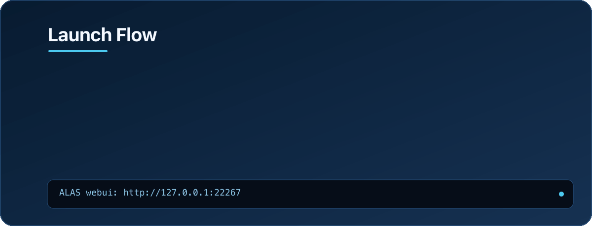
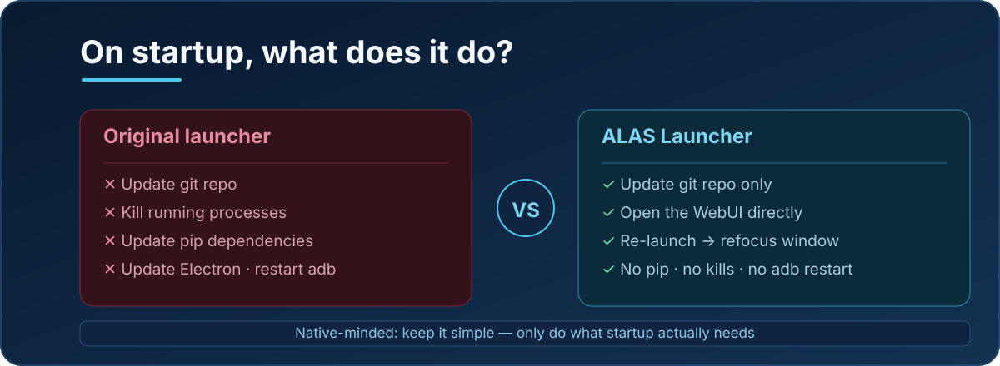
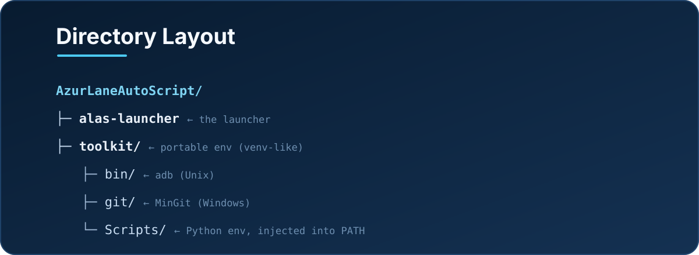
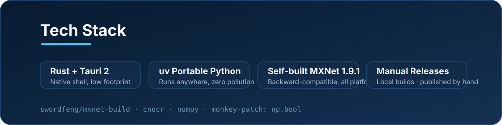

**| English | [简体中文](README.md) |**

# ALAS Launcher

A new type of [AzurLaneAutoScript](https://github.com/LmeSzinc/AzurLaneAutoScript) launcher: **native on every platform** — on Apple Silicon there is no emulation, no Docker, just unzip and play.

  

> Static fallback: `assets/readme/hero-en.svg` (use if the GIF does not render)

## Quick Start

Grab the archive for your system and CPU from **Releases** on the right, extract it, and run the launcher.

| Platform | How to run | Notes |
| --- | --- | --- |
| Windows | Open `alas-launcher.exe` | Windows 7 / 8 / 10 require [WebView2](https://developer.microsoft.com/en-us/microsoft-edge/webview2) |
| macOS | Open `AzurLaneAutoScript.app` | Unsigned: if it errors, run `xattr -dr com.apple.quarantine AzurLaneAutoScript.app` first |
| Linux | Run `alas-launcher` | Requires `libwebkit2gtk-4.1` and a recent `glibc` (CI runs on Ubuntu 22.04) |

**Success check**: the launcher loads and opens the ALAS WebUI (`http://127.0.0.1:22267`). Seeing the familiar ALAS main screen means you are ready.

## Screenshots

<table><tr>
<td></td>
<td></td>
</tr></table>

## Launch Flow

  

The launcher only does what startup needs: update the repo, prepare the portable environment, and open the WebUI. Launching it again only refocuses the existing window — it never kills a running process.

## Differences from the Original

  

1. **Cross-platform**: Windows / macOS (Apple Silicon) / Linux, all native.
2. The original launcher kills existing processes, updates pip, updates Electron resources, and restarts adb on startup; this launcher **only updates the repo**, and a second launch just refocuses the window.
3. Python package versions differ slightly from upstream, but it runs fine. Automatic pip updates are disabled (if upstream adds a requirements file, pip updates can be implemented).
4. Restarting and replacing adb is tricky — **not implemented**.
5. The directory structure is slightly adjusted (see below).

## Directory Layout

  

| Component | Location |
| --- | --- |
| ALAS root | Windows/Linux: `AzurLaneAutoScript` · macOS: `AzurLaneAutoScript.app/Contents/AzurLaneAutoScript` |
| ALAS launcher | Windows: `alas-launcher.exe` · macOS: `.../Contents/MacOS/alas-launcher` · Linux: `alas-launcher` |
| Python | All systems: `toolkit` (venv-like structure) |
| Git | Unix: installed into `toolkit` · Windows: MinGit extracted to `toolkit/git` |
| Adb | Unix: `toolkit/bin/adb` · Windows: `toolkit/adb.exe` |

Environment variables added by the launcher:

- **Unix**: `toolkit/bin` · `toolkit/libexec/git-core` · `toolkit/lib` (`LD_LIBRARY_PATH`)
- **Windows**: `toolkit` · `toolkit/Scripts` · `toolkit/git/cmd`

## Why This Repo Exists

Since getting a Mac Mini, I've been too lazy to press the power button on my PC. But it feels wrong not running ALAS...

This [blog post](https://www.binss.me/blog/run-azurlaneautoscript-on-arm64/) by binss was very inspiring, but its methods rely on a translation layer or Docker containers. As a native purist, I don't want to run user applications inside a shell, nor do I want to mess up my system environment — so why not run ALAS natively on macOS, on Apple Silicon?

## Tech Stack

  

What went into the build:

1. **Compiled MXNet**: PyPI versions don't work, so I had to compile it myself (MXNet's CMake is... challenging, and patches were needed) — a backward-compatible build for all platforms. See [swordfeng/mxnet-build](https://github.com/swordfeng/mxnet-build).
2. Used `uv` to download portable Python, so it runs anywhere.
3. Lots of packages can't compile on arm64 Mac, so many Python package versions were updated. See `requirements.in`.
4. Following binss's blog, chose MXNet 1.9.1 with a newer NumPy; that NumPy dropped `np.bool`, so MXNet got a monkey-patch to add it back.
5. cnocr only accepts mxnet `[1.5.0, 1.7.0)`, so the version was adjusted when packaging.
6. Used Tauri for the shell (the original GUI's Electron could work on Mac, but it looked messy — gave up after brief research).
7. Packaging scripts were originally on GitHub Actions; CI has since been removed and releases are now built and published manually.
8. Deduplicated files: `*-nix` symlinks were packed as copies, so they were deduped with hardlinks. Didn't bother shrinking size further.

## License

Since ALAS is GPLv3, this project is **GPLv3** too. Most dependencies use Apache2, BSD3, etc. — check upstream repos for details.
