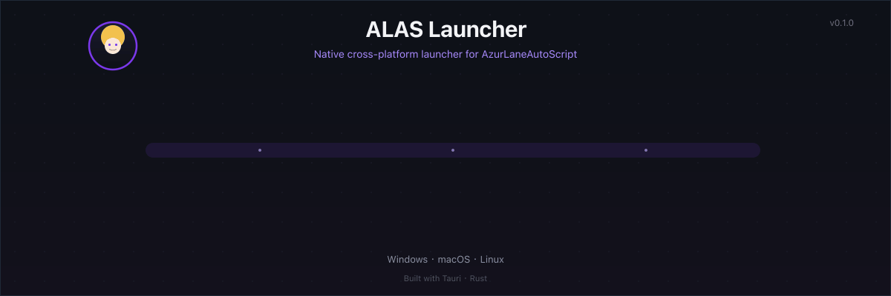

**| English | [简体中文](README.md) |**

# ALAS Launcher: A Cross-Platform Native Launcher for AzurLaneAutoScript

ALAS Launcher is a Tauri 2 (Rust) desktop launcher that starts [AzurLaneAutoScript](https://github.com/LmeSzinc/AzurLaneAutoScript) (ALAS) natively on Windows, macOS, and Linux, with no translation layer and no Docker.

At launch it prepares the runtime environment (Python toolkit, Git, Adb), updates the ALAS repository, starts `gui.py` on a local port, and then opens the local Web UI through the Tauri WebView. The default port is `22267`; it can be changed via `Deploy.Webui.WebuiPort` in `config/deploy.yaml`.

On macOS it also adds a menu bar icon: check the ALAS task list or start/stop the scheduler without opening a window. Start with the [menu bar quick view](#menu-bar-quick-view-macos), compare it against the [launch flow animation](#launch-flow) and the [real interface screenshots](#interface-screenshots), then choose your [download platform](#download-and-platforms).

## Menu Bar Quick View (macOS)


- **Task list at a glance**: mirrors the Web UI scheduler — real ALAS tasks grouped by `Running / Queued / Waiting` with next-run times (at most 3 tasks per group to keep the menu compact; auto-refreshes every 10 seconds, or refresh manually).
- **One-click scheduler toggle**: the toggle controls the ALAS scheduler instead of the backend process — the Web UI stays alive when the scheduler stops; when the backend is not running, the toggle starts the backend first, then the scheduler.
- **macOS only**: the menu bar icon is enabled on macOS only; Windows and Linux builds are unaffected.

If the animation does not play, see the [static screenshot](screenshots/mac-en.webp) or the [static launch-flow diagram](assets/readme/hero.svg).

## Launch Flow



The launcher works in this order:

1. **Initialize**: prepare the runtime environment (PATH, LD_LIBRARY_PATH, and so on).
2. **Update**: clean the ALAS config directory and pull the latest ALAS repository updates.
3. **Launch**: start `gui.py` on a local port (default `22267`).
4. **Ready**: the Tauri WebView navigates to the local Web UI and shows `Ready · 127.0.0.1:22267`.

If the animation does not play, see the [static diagram](assets/readme/hero.svg) (same content).

## Interface Screenshots

Below are real interfaces on macOS and Windows (English interface):

| macOS | Windows |
| --- | --- |
|  |  |

## Download and Platforms

Download the archive for your system and CPU architecture from the [Releases page](https://github.com/Acfufu/alas-launcher/releases), extract it, and launch it the way that fits your platform.

> The remote Release (`v0.1.0`) is currently a manually built draft; it has not been declared a stable public installer, so verify it yourself before use.

- **Windows**: run `alas-launcher.exe`. On Windows 7, 8, or 10, install [WebView2](https://developer.microsoft.com/en-us/microsoft-edge/webview2) first.
- **macOS**: open `AzurLaneAutoScript.app`. The app is unsigned; if Gatekeeper blocks it, open a terminal and run:

  ```bash
  xattr -dr com.apple.quarantine AzurLaneAutoScript.app
  ```

- **Linux**: run `alas-launcher`. The program depends on `libwebkit2gtk-4.1` and a recent `glibc` (CI runs on Ubuntu 22.04). If these dependencies are missing, the launcher may fail to start, though ALAS itself is usually unaffected.

The Web UI listens on port `22267` by default. At startup the launcher reads `config/deploy.yaml`, and the port can be changed via `Deploy.Webui.WebuiPort` there.

## Differences from the Official Version

Compared with the official ALAS launcher, this version has these user-visible differences:

1. **Cross-platform**: the same codebase runs natively on Windows, macOS, and Linux.
2. **macOS menu bar quick view**: the menu bar icon shows the ALAS task list (Running/Queued/Waiting groups, next-run times) and toggles the scheduler without quitting the app (the Web UI stays alive when the scheduler stops).
3. **Only updates the repo at launch**: it no longer kills existing processes, updates pip, updates Electron resources, or restarts adb.
4. **Single instance**: launching again does not open a second window; it refocuses the existing window.
5. **Automatic pip updates are disabled**: Python package versions differ slightly from the official build, but this does not affect usage; if upstream adds a requirements file, pip updates can be implemented again.
6. **adb restart/replacement is not implemented**.
7. **The directory structure is adjusted** (see [Directory Structure and Environment Variables](#directory-structure-and-environment-variables)).

## Workflow


The launch chain is: **launcher → environment setup → read `config/deploy.yaml` (default port `22267`) → clean the config and update the ALAS Git repo → start `gui.py --host 127.0.0.1 --port <configured port>` → Tauri WebView navigates to the local Web UI**.

If the repository update fails, the splash screen keeps showing the error; when you quit, the backend process is terminated. adb replacement, pip auto-update, and remote access are not part of the launcher's job, so the diagram does not include them.

## Building and Assembling the Full Payload

### Building the macOS Launcher Shell

Prerequisites: [Rust](https://rustup.rs) (stable), Node.js (for npx), and Xcode Command Line Tools.

```bash
npx --yes @tauri-apps/cli@2 build --bundles app
```

The output lands in `target/release/bundle/macos/AzurLaneAutoScript.app`.

### Assembling the Full Payload

The output above is only the launcher shell; it does not contain ALAS itself. A fully working build needs the payload (Python toolkit / git / adb / ALAS repository) placed inside `Contents/AzurLaneAutoScript`. You can copy it from an existing installation:

```bash
APP=target/release/bundle/macos/AzurLaneAutoScript.app
cp -R /Applications/AzurLaneAutoScript.app/Contents/AzurLaneAutoScript "$APP/Contents/"
```

Keep complete builds in the `release/` directory (gitignored, so they do not get committed by accident):

```bash
cp -R target/release/bundle/macos/AzurLaneAutoScript.app release/
```


### Releasing

Releasing is a manual flow: build the complete `.app` locally (with payload), put it in `release/`, then publish. The commands are in the collapsible block below; the version number must match the `version` in `tauri.conf.json`:

<details>
<summary>Release commands</summary>

```bash
git tag v0.1.0            # version must match the `version` in tauri.conf.json
git push origin v0.1.0
gh release create v0.1.0 release/AzurLaneAutoScript.app --title "v0.1.0" --notes "..."
```

</details>

## Directory Structure and Environment Variables

The paths below are relative to the ALAS root directory; `toolkit` is the Python environment directory (similar to a venv structure):

| Component | Windows | macOS | Linux |
| --- | --- | --- | --- |
| ALAS root | `AzurLaneAutoScript` | `AzurLaneAutoScript.app/Contents/AzurLaneAutoScript` | `AzurLaneAutoScript` |
| Launcher | `AzurLaneAutoScript/alas-launcher.exe` | `AzurLaneAutoScript.app/Contents/MacOS/alas-launcher` | `AzurLaneAutoScript/alas-launcher` |
| Python | `toolkit` | `toolkit` | `toolkit` |
| Git | MinGit extracted to `toolkit/git` | Unix directory structure installed into `toolkit` | Unix directory structure installed into `toolkit` |
| Adb | `toolkit/adb.exe` | `toolkit/bin/adb` | `toolkit/bin/adb` |

The launcher adds the following environment variables:

- **Unix**: `toolkit/bin`, `toolkit/libexec/git-core`, and `toolkit/lib` (`LD_LIBRARY_PATH`).
- **Windows**: `toolkit`, `toolkit/Scripts`, `toolkit/git/cmd`.

## Limitations, Troubleshooting, and License

### Limitations

- The launcher shell does not include the ALAS payload; it must be assembled manually (see [Building and Assembling the Full Payload](#building-and-assembling-the-full-payload)).
- The macOS app is unsigned; the first launch requires manually removing quarantine.
- The menu bar quick view (task list / scheduler toggle) is enabled on macOS only.
- Linux depends on `libwebkit2gtk-4.1` and a recent `glibc`.
- adb restart/replacement is not implemented, and automatic pip updates are disabled.
- The remote Release is a draft and has not been declared a stable public installer.

### Troubleshooting

| Symptom | Fix |
| --- | --- |
| macOS says the app is damaged or cannot be opened | Run `xattr -dr com.apple.quarantine AzurLaneAutoScript.app` |
| The Linux launcher will not start, but ALAS itself runs | Install `libwebkit2gtk-4.1`, or upgrade the system `glibc` |
| The port is occupied, or you want a different port | Change `Deploy.Webui.WebuiPort` in `config/deploy.yaml` (default `22267`) |
| The menu bar task list is empty or shows "Tasks: unavailable" | Make sure the ALAS backend is running (start it from the menu); task data is read directly from `config/alas.json` |

### License

Because ALAS uses GPLv3, this launcher uses GPLv3 too. Most dependencies use permissive licenses such as Apache-2.0 and BSD-3-Clause; check each upstream repository for details.
