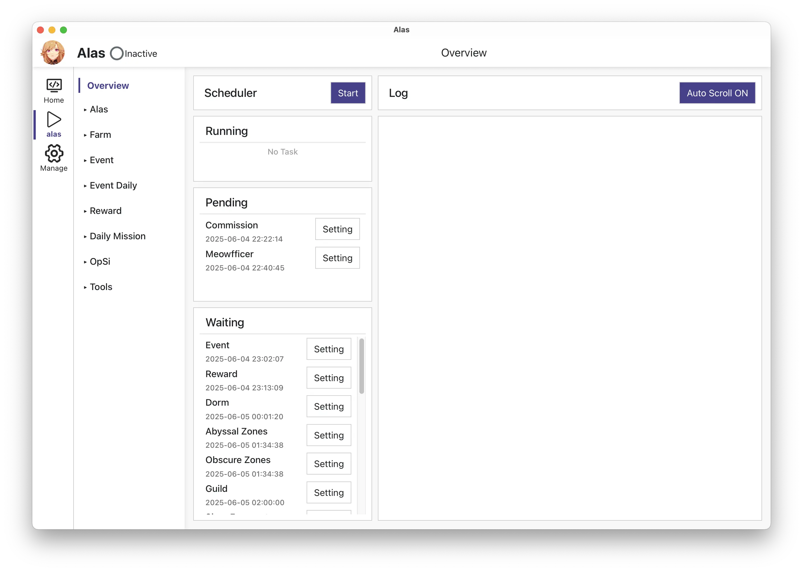
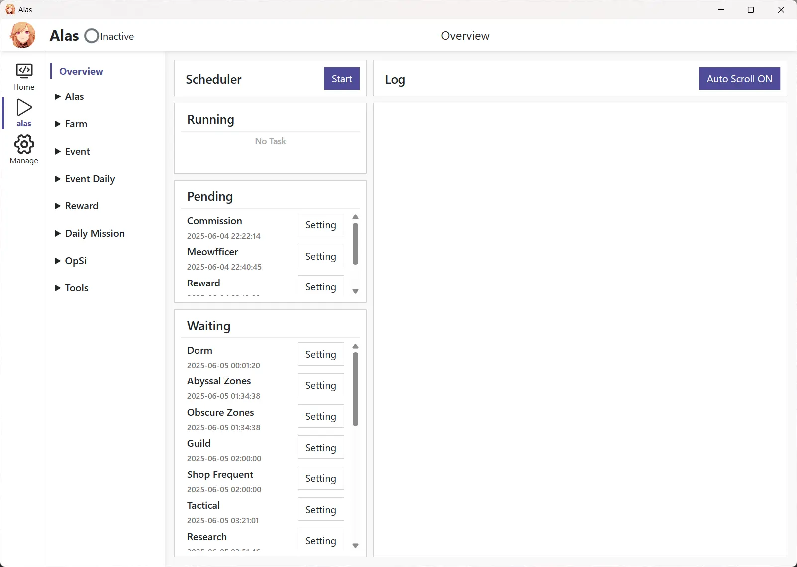

**| English | [简体中文](README.md) |**

# ALAS Launcher — a native cross-platform launcher for AzurLaneAutoScript

A Tauri 2 (Rust) desktop launcher that starts [AzurLaneAutoScript](https://github.com/LmeSzinc/AzurLaneAutoScript) (ALAS) natively on Windows, macOS, and Linux — no translation layer, no Docker. It prepares the runtime environment, updates the ALAS repository, and opens the local Web UI for you.

## Interface

| macOS | Windows |
| --- | --- |
|  |  |

### Menu-bar overview (macOS)

On macOS there is a menu-bar icon: inspect the ALAS task list and start or stop the scheduler without opening a window.


- **Live task list**: consistent with the Web UI scheduler — real ALAS tasks read from `config/alas.json`, grouped by `Running / Queued / Waiting`, with the next scheduled time; up to 3 per group to keep the menu compact, auto-refreshed every 3 seconds (manual refresh too).
- **One-click scheduler toggle**: the menu toggle controls the ALAS scheduler, not the backend process — stopping the scheduler keeps the Web UI alive; if the backend is not running, the toggle starts it first.
- **macOS only**: the menu-bar icon is currently enabled only on macOS; Windows / Linux builds are unaffected.

If the animation does not play, see the [static screenshot](screenshots/mac-en.webp).

## What it does

The launcher automates the whole chain — prepare the environment, update the repository, launch the Web UI:


1. **Initialize**: prepares the runtime environment (PATH, LD_LIBRARY_PATH, etc.) and reads the Web UI port from `config/deploy.yaml`.
2. **Update**: cleans the ALAS config directory and pulls the latest ALAS repository.
3. **Launch**: starts `gui.py` on the local port (`gui.py --host 127.0.0.1 --port <configured port>`).
4. **Ready**: the Tauri WebView opens the local Web UI, showing `Ready · 127.0.0.1:<port>`.

If the repository update fails, the splash screen keeps showing the error; quitting the launcher terminates the backend process. adb replacement, pip auto-update, and remote access are not part of the launcher's responsibility.

## Differences from the official launcher

| Capability | Official launcher | This launcher |
| --- | --- | --- |
| Platforms | Single platform | The same codebase natively supports Windows, macOS, and Linux |
| macOS task overview | None | Menu-bar task list + native notifications (scheduler abnormal-death alert on by default, task-complete optional) |
| Scheduler control channel | Web page button | Control API patch (HTTP, same ProcessManager as the web page; degrades to process-level control with password/SSL) |
| Startup behavior | Kills existing processes, updates pip, updates Electron resources, restarts adb | Only updates the repository — no other side effects |
| Repeated launch | Opens a new window | Single instance: refocuses the existing window |
| pip auto-update | Yes | Disabled (Python package versions differ slightly from the official version; does not affect usage) |
| adb restart / replacement | Yes | Not implemented |

The directory layout is also adjusted — see [Directory structure and environment variables](#directory-structure-and-environment-variables).

## Quick start

Download the archive for your system and CPU architecture from the [Releases page](https://github.com/Acfufu/alas-launcher/releases), extract it, and launch it as described below.

> [!IMPORTANT]
> The current remote Release (`v0.1.0`) is a manually built draft; it is not yet declared a stable public installer. Verify it yourself before use.

| Platform | Launch | Notes |
| --- | --- | --- |
| Windows | Run `alas-launcher.exe` | Windows 7 / 8 / 10 require [WebView2](https://developer.microsoft.com/microsoft-edge/webview2) first |
| macOS | Open `AzurLaneAutoScript.app` | Unsigned; if Gatekeeper blocks it, run the command below |
| Linux | Run `alas-launcher` | Requires `libwebkit2gtk-4.1` and a recent `glibc` (CI uses Ubuntu 22.04); without them the launcher may not run, but ALAS itself is usually unaffected |

If Gatekeeper blocks the app on first launch on macOS:

```bash
xattr -dr com.apple.quarantine AzurLaneAutoScript.app   # remove the quarantine attribute
```

**Success signal**: once ready, the launcher automatically opens the local Web UI showing `Ready · 127.0.0.1:22267`.

## Configuration

The Web UI listens on port `22267` by default. The launcher reads `config/deploy.yaml` on startup; change the port via `Deploy.Webui.WebuiPort` in that file.

- **Language**: switching the language only affects the launcher UI (menu bar, tray, stop page); the ALAS web pages always follow `Gui.Language` in `config/deploy.yaml`, and the two may differ (by design).
- **Password / SSL**: after configuring `Deploy.Webui.Password` / `WebuiSSLKey` / `WebuiSSLCert`, the menu-bar scheduler toggle degrades to process-level control (the scheduler can no longer be driven through the control API), and the tray status line appends a "password/SSL configured, process-level control only" hint.

## Building and releasing

> For maintainers. End users do not need to build anything — download from [Releases](https://github.com/Acfufu/alas-launcher/releases) instead.

<details>
<summary>Build the macOS launcher shell</summary>

Dependencies: [Rust](https://rustup.rs) (stable), Node.js (provides npx), Xcode Command Line Tools.

```bash
npx --yes @tauri-apps/cli@2 build --bundles app         # build the macOS app shell
```

The artifact is at `target/release/bundle/macos/AzurLaneAutoScript.app`.

**Assemble the full payload.** The artifact above is only the launcher shell — it does not contain ALAS itself. A fully usable build needs the payload (Python toolkit / git / adb / ALAS repository) inside `Contents/AzurLaneAutoScript`. You can copy it from an existing installation:

```bash
APP=target/release/bundle/macos/AzurLaneAutoScript.app
cp -R /Applications/AzurLaneAutoScript.app/Contents/AzurLaneAutoScript "$APP/Contents/"   # copy ALAS from an existing installation
```

Put complete artifacts in the `release/` directory (gitignored, to avoid accidental commits):

```bash
cp -R target/release/bundle/macos/AzurLaneAutoScript.app release/   # complete artifacts live here (gitignored)
```


**Release.** Releasing is a manual process: build the complete `.app` locally (with payload), put it in `release/`, then publish. The version number must match the `version` in `tauri.conf.json`:

```bash
git tag v0.1.0            # version must match the version in tauri.conf.json
git push origin v0.1.0
gh release create v0.1.0 release/AzurLaneAutoScript.app --title "v0.1.0" --notes "..."
```

</details>

## Directory structure and environment variables

Paths below are relative to the ALAS root; `toolkit` is the Python environment directory (a venv-like layout):

| Component | Windows | macOS | Linux |
| --- | --- | --- | --- |
| ALAS root | `AzurLaneAutoScript` | `AzurLaneAutoScript.app/Contents/AzurLaneAutoScript` | `AzurLaneAutoScript` |
| Launcher | `AzurLaneAutoScript/alas-launcher.exe` | `AzurLaneAutoScript.app/Contents/MacOS/alas-launcher` | `AzurLaneAutoScript/alas-launcher` |
| Python | `toolkit` | `toolkit` | `toolkit` |
| Git | MinGit extracted into `toolkit/git` | Unix layout packed into `toolkit` | Unix layout packed into `toolkit` |
| Adb | `toolkit/adb.exe` | `toolkit/bin/adb` | `toolkit/bin/adb` |

The launcher adds the following environment variables:

- **Unix**: `toolkit/bin`, `toolkit/libexec/git-core`, and `toolkit/lib` (`LD_LIBRARY_PATH`).
- **Windows**: `toolkit`, `toolkit/Scripts`, `toolkit/git/cmd`.

## Limitations, troubleshooting, and license

### Limitations

- The launcher shell does not include the ALAS payload; it must be assembled manually (see [Building and releasing](#building-and-releasing)).
- The macOS app is unsigned; the first launch requires manually clearing quarantine.
- The menu-bar overview (task list / scheduler toggle) is only enabled on macOS.
- Scheduler start/stop relies on the control API patch to ALAS (anchored on `module/webui/fastapi.py`, unchanged since 2022-04-14); if the anchor fails, the menu-bar scheduler toggle degrades to process-level control (never a silent no-op).
- Linux requires `libwebkit2gtk-4.1` and a recent `glibc`.
- adb restart/replacement is not implemented; pip auto-update is disabled.
- The remote Release is a draft and has not been declared a stable public installer.

### Troubleshooting

| Symptom | Fix |
| --- | --- |
| macOS says the app is damaged or cannot be opened | Run `xattr -dr com.apple.quarantine AzurLaneAutoScript.app` |
| The Linux launcher does not start, but ALAS itself runs | Install `libwebkit2gtk-4.1`, or upgrade the system `glibc` |
| The port is occupied, or you want to change it | Change `Deploy.Webui.WebuiPort` in `config/deploy.yaml` (default `22267`) |
| The menu-bar task list is empty or shows "Tasks: unavailable" | Make sure the ALAS backend is running (the menu can start it in one click); task data comes directly from `config/alas.json` |

### License

Because ALAS is GPLv3, this launcher is also GPLv3. Most dependencies are under permissive licenses such as Apache-2.0 and BSD-3-Clause; see each upstream repository for details.
